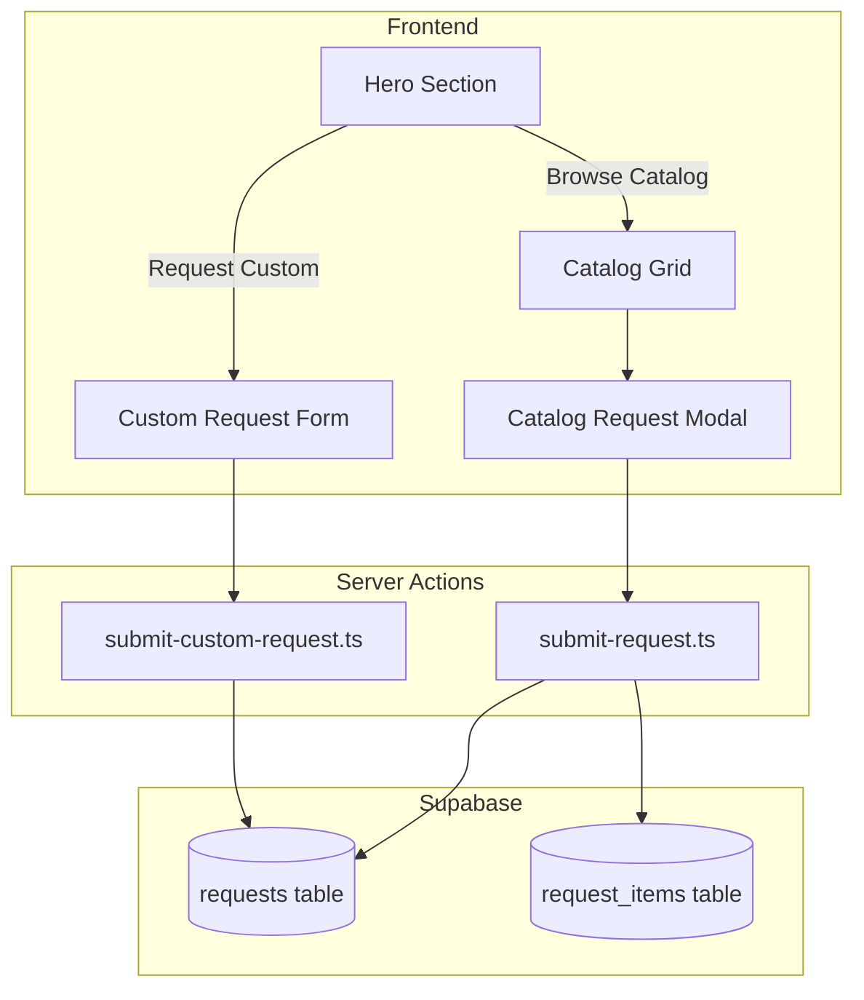

# Architecture

Technical reference for the Skills & Agents Marketplace.

## System Overview



## Database Schema

### requests table

| Column | Type | Description |
|--------|------|-------------|
| id | UUID | Primary key |
| created_at | TIMESTAMP | Auto-generated |
| name | TEXT | Requester name |
| email | TEXT | Requester email |
| company_team | TEXT | Company or team name |
| use_case | TEXT | Request description |
| status | TEXT | pending, approved, delivered |
| request_type | TEXT | 'catalog' or 'custom' |
| business_category | TEXT | Custom: selected category |
| current_process | TEXT | Custom: how they handle it today |
| pain_points | TEXT | Custom: what's not working |
| desired_outcome | TEXT | Custom: what success looks like |
| tools_used | TEXT | Custom: current tech stack (optional) |
| team_size | TEXT | Custom: team size (optional) |

### request_items table

| Column | Type | Description |
|--------|------|-------------|
| id | UUID | Primary key |
| request_id | UUID | Foreign key to requests |
| item_type | TEXT | 'skill' or 'agent' |
| item_name | TEXT | Name of selected item |
| created_at | TIMESTAMP | Auto-generated |

## Request Flows

### Catalog Flow

1. User browses catalog grid with search/filter
2. Selects one or more items
3. Clicks floating "Request X Items" button
4. Modal form opens with contact fields
5. Server action `submit-request.ts` validates and inserts
6. Creates row in `requests` with `request_type='catalog'`
7. Creates rows in `request_items` for each selected item

### Custom Flow

1. User clicks "Request AI Agent Build" in hero
2. Smooth scrolls to custom request section
3. Completes 4-step inline form:
   - Step 1: Select business category (9 options)
   - Step 2: Current process + pain points
   - Step 3: Desired outcome + tools + team size
   - Step 4: Name, email, company
4. Server action `submit-custom-request.ts` validates and inserts
5. Creates row in `requests` with `request_type='custom'`
6. No `request_items` created (custom has no predefined items)

## Component Structure

```
src/
├── app/
│   ├── page.tsx                 # Main page, orchestrates sections
│   ├── layout.tsx               # Root layout with metadata
│   └── actions/
│       ├── submit-request.ts    # Catalog request handler
│       └── submit-custom-request.ts  # Custom request handler
├── components/
│   ├── sections/
│   │   ├── hero.tsx             # Hero with particle animation
│   │   └── custom-request-section.tsx  # 4-step form
│   ├── ui/
│   │   └── word-reveal.tsx      # Text animation component
│   ├── catalog-grid.tsx         # Grid with filters
│   ├── catalog-card.tsx         # Individual item card
│   ├── request-form.tsx         # Catalog request modal
│   └── particle-animation.tsx   # Background particles
└── lib/
    ├── catalog/
    │   ├── skills-agents.ts     # Catalog data
    │   └── types.ts             # TypeScript interfaces
    ├── supabase/
    │   ├── client.ts            # Browser Supabase client
    │   └── server.ts            # Server Supabase client
    └── utils.ts                 # Utility functions
```

## Key Components

### Hero (`src/components/sections/hero.tsx`)

- Full viewport height
- Particle animation background (30% opacity)
- WordReveal text animation
- Two CTA buttons with smooth scroll handlers
- Framer Motion for animations

### Custom Request Section (`src/components/sections/custom-request-section.tsx`)

- 4-step inline form with progressive disclosure
- `useState` for step and form data management
- `useActionState` for server action integration
- Category badge visible in steps 2-4
- Framer Motion AnimatePresence for step transitions
- Zod validation via server action

### Server Actions

**submit-request.ts** (Catalog)
- Validates: name, email, company_team, use_case, selected items
- Inserts to `requests` with `request_type='catalog'`
- Inserts to `request_items` for each selected item

**submit-custom-request.ts** (Custom)
- Validates: business_category, current_process, pain_points, desired_outcome, name, email, company_team
- Inserts to `requests` with `request_type='custom'`
- Optional fields: tools_used, team_size

## Business Categories

Nine categories available for custom requests:

1. Content Creation & Distribution
2. Sales & Lead Generation
3. Marketing Automation & Workflows
4. SEO & Analytics
5. Email Marketing & Nurture
6. Customer Research & Intelligence
7. Social Media Management
8. Data Integration & Reporting
9. Other

## Database Migrations

| File | Purpose |
|------|---------|
| `001_create_tables.sql` | Creates requests and request_items tables |
| `002_add_custom_requests.sql` | Adds custom request columns to requests table |

