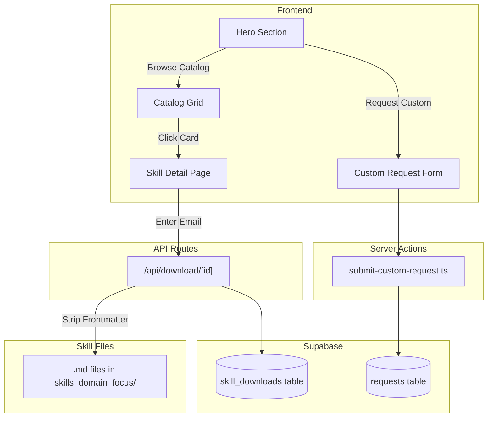

# Architecture

Technical reference for the Skills & Agents Marketplace.

## System Overview



## Database Schema

### skill_downloads table

Tracks all skill file downloads for analytics.

| Column | Type | Description |
|--------|------|-------------|
| id | UUID | Primary key |
| skill_id | TEXT | Skill identifier from catalog |
| skill_name | TEXT | Human-readable skill name |
| email | TEXT | Downloader's email |
| downloaded_at | TIMESTAMP | Auto-generated |

### requests table

Used for custom skill/agent build requests.

| Column | Type | Description |
|--------|------|-------------|
| id | UUID | Primary key |
| created_at | TIMESTAMP | Auto-generated |
| name | TEXT | Requester name |
| email | TEXT | Requester email |
| company_team | TEXT | Company or team name |
| use_case | TEXT | Request description |
| status | TEXT | pending, approved, delivered |
| request_type | TEXT | 'catalog' or 'custom' |
| business_category | TEXT | Custom: selected category |
| current_process | TEXT | Custom: how they handle it today |
| pain_points | TEXT | Custom: what's not working |
| desired_outcome | TEXT | Custom: what success looks like |
| tools_used | TEXT | Custom: current tech stack (optional) |
| team_size | TEXT | Custom: team size (optional) |

### request_items table (legacy)

| Column | Type | Description |
|--------|------|-------------|
| id | UUID | Primary key |
| request_id | UUID | Foreign key to requests |
| item_type | TEXT | 'skill' or 'agent' |
| item_name | TEXT | Name of selected item |
| created_at | TIMESTAMP | Auto-generated |

## User Flows

### Skill Download Flow

1. User browses catalog grid with search/filter
2. Clicks a skill card to open skill detail page (`/skill/[id]`)
3. Reads skill description and Claude implementation instructions
4. Enters email address and clicks "Download Skill"
5. API route `/api/download/[id]`:
   - Logs download to `skill_downloads` table
   - Reads `.md` file from file system
   - Strips YAML frontmatter for clean Claude import
   - Returns file as download
6. User uploads downloaded `.md` file to Claude Project

### Custom Request Flow

1. User clicks "Request AI Agent Build" in hero
2. Smooth scrolls to custom request section
3. Completes 4-step inline form:
   - Step 1: Select business category (9 options)
   - Step 2: Current process + pain points
   - Step 3: Desired outcome + tools + team size
   - Step 4: Name, email, company
4. Server action `submit-custom-request.ts` validates and inserts
5. Creates row in `requests` with `request_type='custom'`

## Component Structure

```
src/
├── app/
│   ├── page.tsx                 # Main page, orchestrates sections
│   ├── layout.tsx               # Root layout with metadata
│   ├── skill/
│   │   └── [id]/
│   │       └── page.tsx         # Skill detail page with download
│   ├── api/
│   │   └── download/
│   │       └── [id]/
│   │           └── route.ts     # Download API, strips frontmatter
│   └── actions/
│       ├── submit-request.ts    # Catalog request handler (legacy)
│       └── submit-custom-request.ts  # Custom request handler
├── components/
│   ├── sections/
│   │   ├── hero.tsx             # Hero with particle animation
│   │   └── custom-request-section.tsx  # 4-step form
│   ├── ui/
│   │   └── word-reveal.tsx      # Text animation component
│   ├── catalog-grid.tsx         # Grid with filters
│   ├── catalog-card.tsx         # Clickable card linking to detail
│   ├── claude-instructions.tsx  # Step-by-step Claude setup guide
│   ├── download-form.tsx        # Email capture + download trigger
│   └── particle-animation.tsx   # Background particles
└── lib/
    ├── catalog/
    │   ├── skills-agents.ts     # Catalog data with file paths
    │   └── types.ts             # TypeScript interfaces
    ├── supabase/
    │   ├── client.ts            # Browser Supabase client
    │   └── server.ts            # Server Supabase client
    └── utils.ts                 # Utility functions
```

## Key Components

### Hero (`src/components/sections/hero.tsx`)

- Full viewport height
- Particle animation background (30% opacity)
- WordReveal text animation
- Two CTA buttons with smooth scroll handlers
- Framer Motion for animations

### Skill Detail Page (`src/app/skill/[id]/page.tsx`)

- Static generation for all skills via `generateStaticParams`
- Displays skill info, description, and use cases
- Embeds `ClaudeInstructions` component
- Embeds `DownloadForm` component
- Responsive two-column layout

### Claude Instructions (`src/components/claude-instructions.tsx`)

- Step-by-step guide for uploading skills to Claude Projects
- 4 numbered steps with clear descriptions
- Pro tip section for combining multiple skills

### Download Form (`src/components/download-form.tsx`)

- Email input with validation
- Triggers download via `/api/download/[id]`
- Shows success state after download completes
- "Download again" option

### Download API (`src/app/api/download/[id]/route.ts`)

- Validates skill ID exists in catalog
- Logs download to `skill_downloads` table
- Reads `.md` file from file system
- Strips YAML frontmatter (content between `---` markers)
- Returns file with proper download headers

### Custom Request Section (`src/components/sections/custom-request-section.tsx`)

- 4-step inline form with progressive disclosure
- `useState` for step and form data management
- `useActionState` for server action integration
- Category badge visible in steps 2-4
- Framer Motion AnimatePresence for step transitions
- Zod validation via server action

### Server Actions

**submit-custom-request.ts** (Custom)
- Validates: business_category, current_process, pain_points, desired_outcome, name, email, company_team
- Inserts to `requests` with `request_type='custom'`
- Optional fields: tools_used, team_size

## Business Categories

Nine categories available for custom requests:

1. Content Creation & Distribution
2. Sales & Lead Generation
3. Marketing Automation & Workflows
4. SEO & Analytics
5. Email Marketing & Nurture
6. Customer Research & Intelligence
7. Social Media Management
8. Data Integration & Reporting
9. Other

## Database Migrations

| File | Purpose |
|------|---------|
| `001_create_tables.sql` | Creates requests and request_items tables |
| `002_add_custom_requests.sql` | Adds custom request columns to requests table |
| `003_add_skill_downloads.sql` | Creates skill_downloads table for tracking |

